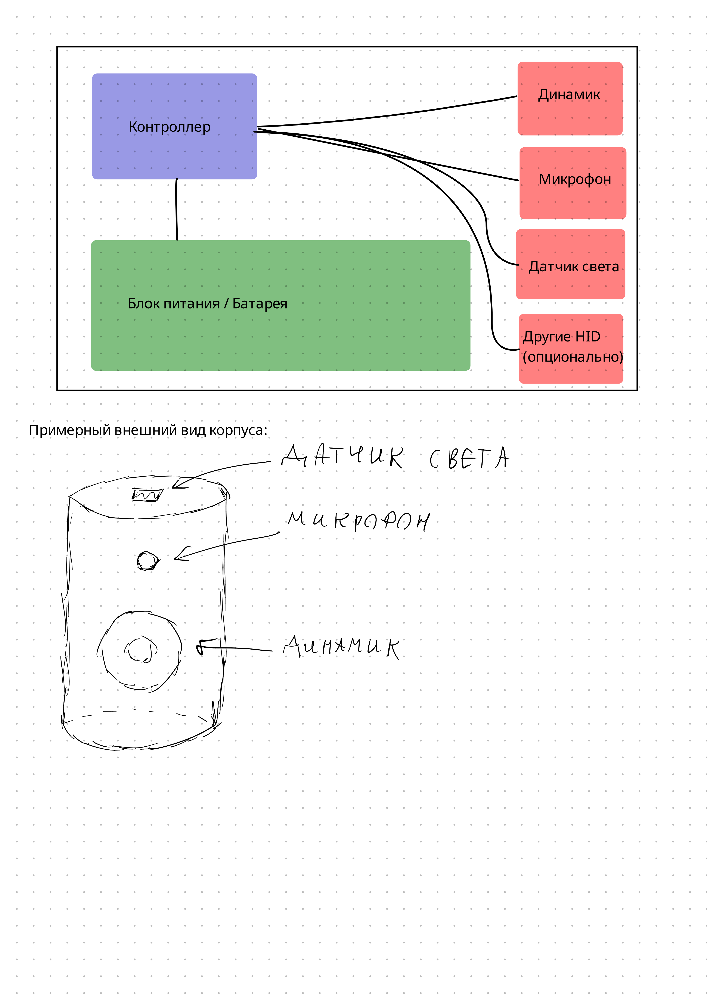

# Предложение проекта: Компактная узко специализированная не очень умная колонка (Конфач-инатор)

__Команда:__ Сидорчук Максим (sidorchuk.me@phystech.edu, @tupatoster), Эдуард Сурженко (surzhenko.ea@phystech.edu)

__Цель проекта:__ Привнести частичку добра и позитива выкладываемого в физтех.конфешнс в каждый дом.

__Технические цели проекта:__ Выбрать наиболее подходящий для цели микроконтроллер/микропроцессор (Arduino nano, Raspberry PI и т.д.); Определить набор переферийных устройств (микрофоны, датчики света/температуры, динамики, экран и т.п.); Исследовать пригодность AI инструментов по типу ChatGPT или Deepseek для обработки данных и формирования ответа; Спроектировать 3д модель корпуса и схему подключения/питания компонентов; Изготовить и закупить необходимые детали и материалы для сборки данной конструкции; Собрать модель и отладить программное обеспечение; Провести испытания в формате подтверждение концепта.

__Существующие аналоги__:

Аналогичные более умные колонки уже широко распространены на рынке. Например [Amazon Alexa](https://alexa.amazon.com/) или [Яндекс Станция](https://alice.yandex.ru/station)

Проекты с открытым исходным кодом в основном существуют только в программном виде. К примеру - [Rhasspy](https://github.com/rhasspy/rhasspy). Правда по большей части похожие проекты были заброшены в последние пару лет.

__Эскиз проекта__:

